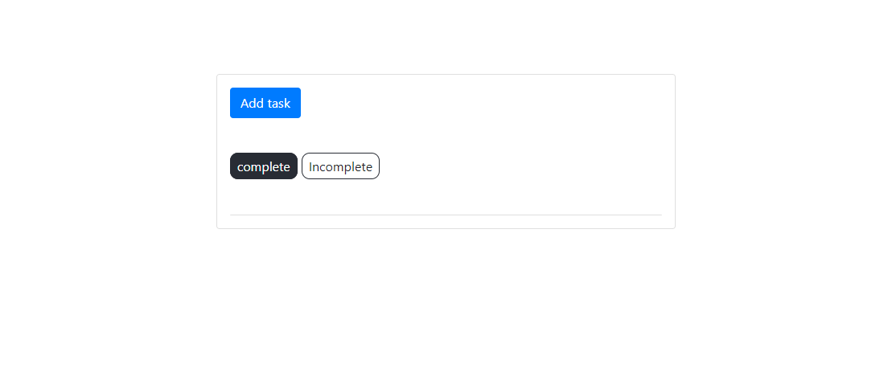
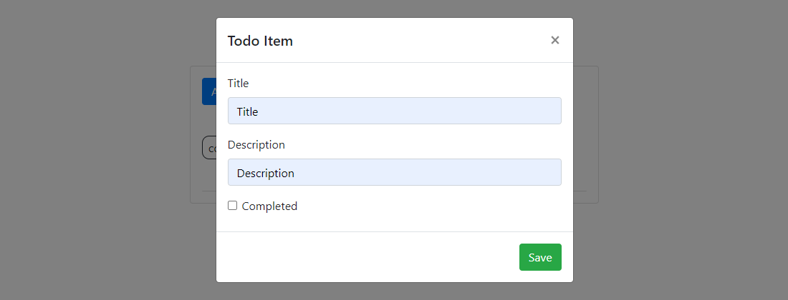
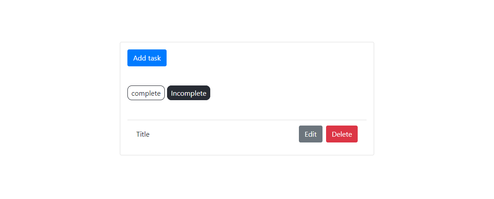
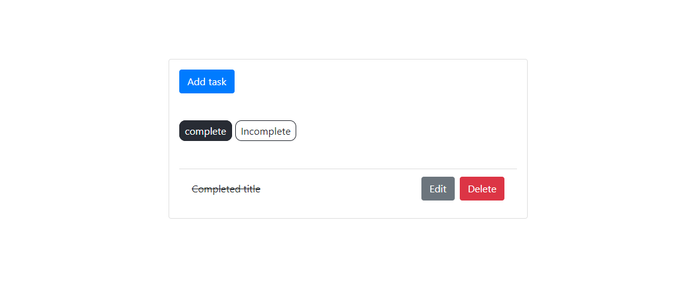

# Lab 10

Tym razem bez linku, musiałbym uruchomić dwie rzeczy na jednej instancji heroku.
Bez tworzenia dodatkowego wątku się nie obejdzie.

Szczerze powiedziawszy nie mam pomysłu jak mógłbym rozbudować aplikację z listą i dodawaniem pozycji.
Oczywiscie to nie problem dodać kolejne pole tekstowe, wielokrotnego lub jednokrotnego wyboru, czy jakiś guzik.
Wszystkie akcje w obrębie tego projektu są stosunkowo proste i niezbyt zaawansowane.

## Linki do kodu

[Frontend w Reakcie](https://github.com/Evolveye/aplikacje-internetowe-21717-185ic/tree/master/react-frontend)  
[Aplikacja "Todo" w Django](https://github.com/Evolveye/aplikacje-internetowe-21717-185ic/tree/master/apps/todo)  
[Zakomentowana wymagana autoryzacja dostępu do API](https://github.com/Evolveye/aplikacje-internetowe-21717-185ic/blob/master/apps/apps/settings.py#L167)

## Zrzuty z działania frontendu:

