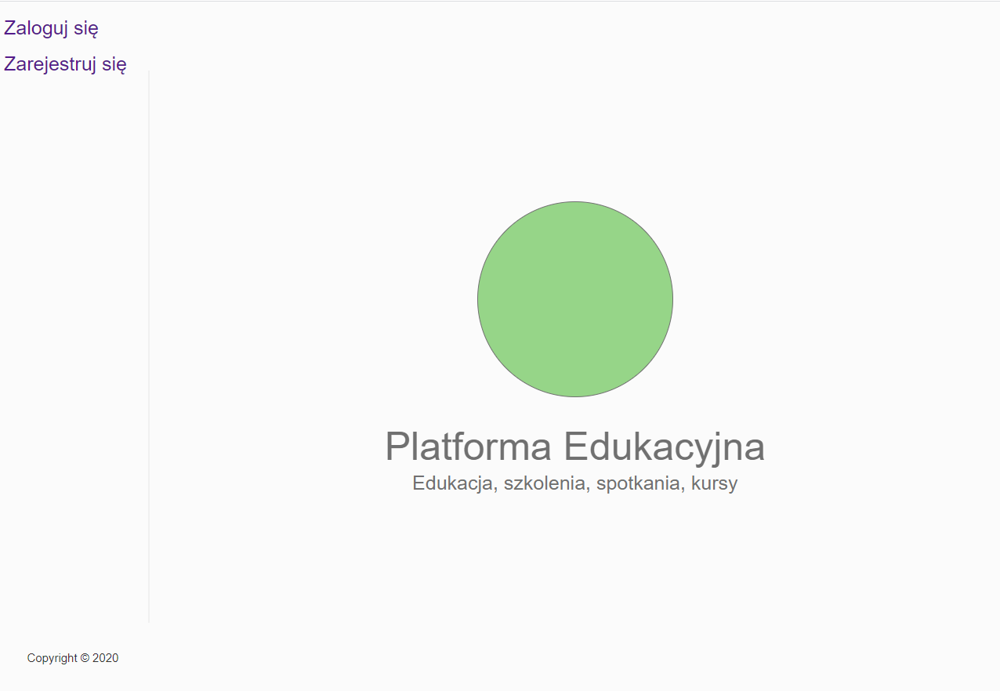
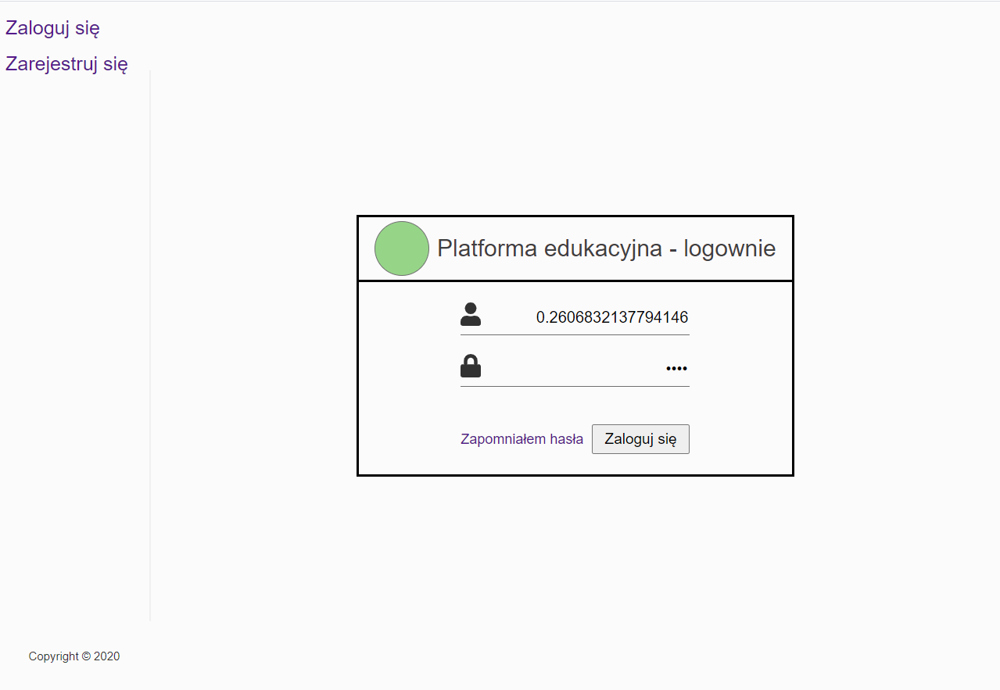
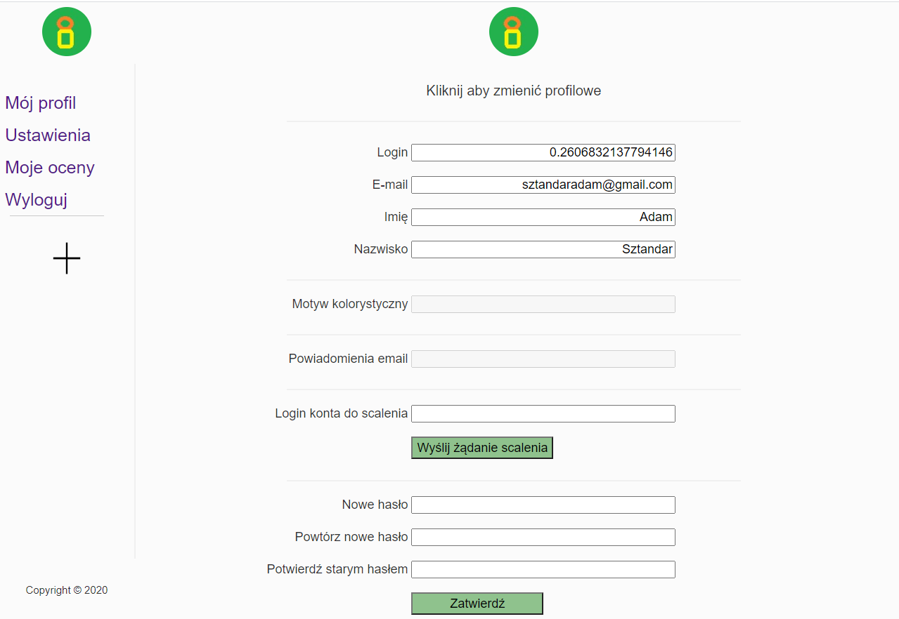

# Lab 7, 8, 9

Praca ta spełnia wymagania każdej ze wspomnianych trzech laborek
 * **Lab 7**: python + redis + Django -- u nas JavaScript + MongoDb + Node.js
 * **Lab 8**: czat z użyciem django channels -- u nas to po prostu web socket. czat będziemy też robić ale mozemy już pokazac odbiór zdarzen i emity (tak działą czat)
 * **Lab 9**: Django + React -- u nas Node.js + Gatsby

## Linki do kodu

<a href="https://github.com/Evolveye/aplikacje-internetowe-21717-185ic/blob/master/lab 7 8 9/backend/src/dbManager.js">
  Menedżer bazy danych MongoDb
</a>
 
<a href="https://github.com/Evolveye/aplikacje-internetowe-21717-185ic/blob/master/lab 7 8 9/backend/modules/user/index.js#L258">
  Pojedyncze zdarzenie WebSocket (odbiór danych i odesłanie
</a>

## Zrzuty z działania frontendu:

